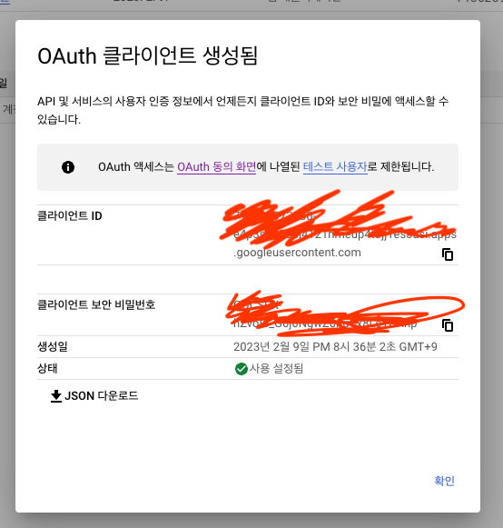
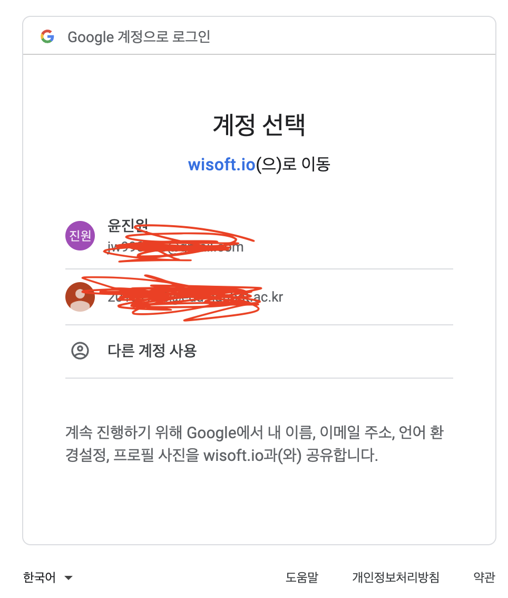

# 😅 2023.02.09

## 할일 및 한일&#x20;

* [ ] 정보처리기사 필기 학습&#x20;
* [x] Vue.js 세미나 참여&#x20;
* [x] Nest.js OAuth 구현&#x20;

## 경험 및 배움&#x20;

### Vue.js 세미나 참여

오늘은 저저번주에 이어서, 교수님이 직접 인프런 유료 강의를 학습하게 해주셨다.

강의의 커리큘럼은 우선 공식 도큐먼트의 튜토리얼, 그리고 시작하기에 있는 문법들을 모은 기본편, 그리고 프로젝트를 하며 배워보는 실전편으로 나뉘었다.

강의의 처음부터 성실히 따라가며 기록해볼 생각이다.



### Nest.js OAuth 구현&#x20;

연구실 동료인 동권이가 작성한 코드를 참고하며, Google Cloud에 가서 직접 클라이언트 ID 및 보안 비밀번호를 받아서 OAuth를 진행해보았다.

몇 일 전까지만 해도 `nest new 프로젝트명` 명령어가 실행되지 않아 프로젝트 생성조차 막혔으나, 검색하고 여쭤본 끝에 나온 답은 네트워크가 문제였다!

핫스팟으로 하면 정상적으로 작동되었다.

결국 팀원의 깃헙을 클론하고, 거기서 나머지 작업들을 실행하는 식으로 학습해보았다.

<figure><figcaption></figcaption></figure>

<figure><figcaption></figcaption></figure>

Google Cloud에 가서 설정을 진행하고, 아직 구현된 프론트가 없으니 리디렉션 URI를 기존 연구실 홈페이지로 진행한 결과, OAuth가 정상적으로 진행되었다.

다음주 까지는 진행 과정에서 토큰을 주고받고 하는 과정, 그리고 결과를 그림으로도 그려보고, 이해하는데 집중할 생각이다.

## 개선 및 목표

* 내일은 자료구조 세미나가 예정되어 있다.&#x20;
* 남은 시간에는 개인 학습을 조금이라도 진행하자.&#x20;
