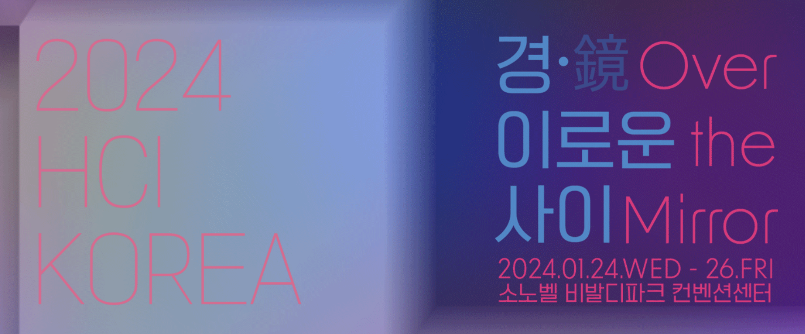

# 🙂 2023.03.06

## 할일 및 한일&#x20;

* [x] 전공 수업&#x20;
* [x] 캡스톤 교수님 미팅&#x20;
* [x] 정보처리기사 기출 CBT 풀이&#x20;
* [x] 캡스톤 디자인 회원, 게시판 CRUD&#x20;

## 경험 및 배움&#x20;

### 정보처리기사 기출 CBT 풀이&#x20;

오늘도 역시 성적이 별반 다르지 않다.

이제 화, 수, 목 3일 남았는데 기출 문제와 5단원 이론을 계속 보아야겠다.

<figure><figcaption></figcaption></figure>

### 캡스톤 디자인 회원, 게시판 CRUD&#x20;

오늘은 **회원과 게시판 CRUD**를 만들어보았다.

정확히 말하면 U와 D는 아직이다..ㅎ

매일매일 조금씩 꾸준하게 개발해야겠다.

<figure><figcaption></figcaption></figure>

## 개선 및 목표&#x20;

* 내일은 학교 수업이 오전, 오후가 예정되어 있다.&#x20;
* 남는 시간에는 캡스톤, 정보처리기사 시험을 대비하자.&#x20;
